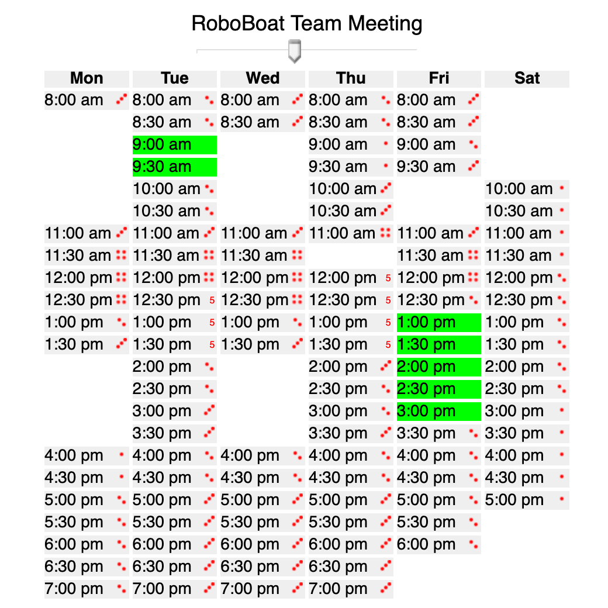
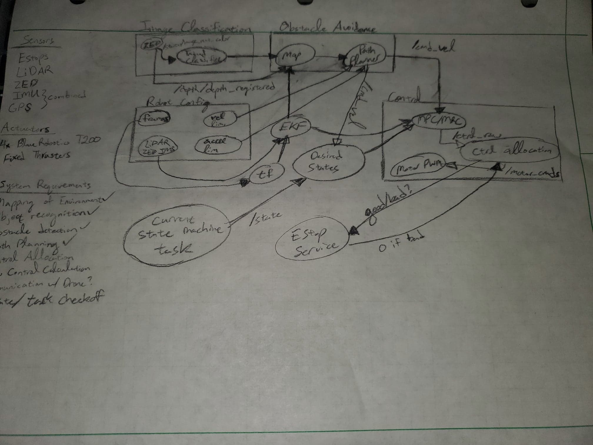

Date: 03/18/2020
Team Lead: Benjamin Armentor - benjamin.armentor1@louisiana.edu    
Members:
* Joseph Stevens - joseph.stevens1@louisiana.edu
* Gerald Eaglin - gerald.eaglin1@louisiana.edu
* Dallas Mitchell - dallas.mitchell1@louisiana.edu
* Nathan Madsen - nathan.madsen1@louisiana.edu
* Andrew Durand - andrew.durand1@louisiana.edu
* Thomas Poche - thomas.poche1@louisiana.edu
* Bradley Este - bradley.este1@louisiana.edu

# Project Boards
## Media: https://github.com/CRAWlab/RoboBoat-2020/projects/1
## Code: https://github.com/CRAWlab/roboboat/projects/1

# RoboBoat Meeting Time
Below is the current state of the WhenIsGood responses I have -- I'm still waiting on Bradley's. I did @mention him on Slack once he joined, but I'm not sure if he saw it. I'll do it one more time tomorrow and email him. Currently, it's looking like Friday afternoons, which, if we're back on campus, lends itself to working on it as well. I'm also okay with having one Tuesday for a check-in of issues and Friday be dedicated to a workday, or something similar. I know you're still adjusting/transitioning to telecommuting, but is there a time that works better for you?

**Figure 1: WhenIsGood Responses from RoboBoat Team Members**

# RoboBoat System Design

## Mapping
As stated earlier, I think that `rtabmap`. The existing implementation is `gmapping`, correct? I like that `rtabmap` lends itself well to implementation with the stereo camera. By the time the first meeting happens, which should hopefully be next week, this, and more design considerations will be discussed with several options available.

> ***BA*** We had our first conference call on Zoom with Dr. Barhorst today. We had an ID and password, and could record it. I'm not sure how big of a file it would be, but do you think it needs to be a secured meeting room? Also, would you want the recordings on the server or somewhere else?

## Controller Design
The two leading frontrunners for control methods are MPC and Model Reference Control. In either case, only one person (myself or Gerald) are familiar enough to implement each method, respectively.

## High Level System Architecture
Similar to when I was working on the `rqt_graph` for `C-Interceptor`, I attempted a sketch of what I think needs to be on RoboBoat. I came up with the following:

**Figure 2: High-Level RQT Graph**

### Image Classification
I have a node for the ZED in the upper-left corner of the graph that is publishing a `/stereo/iamge_rect_color` `sensor_msgs/image` message to a node that is a trained image classifier. I am really unfamiliar with how this works, and I'd imagine there is a lot more to it than this. 

> ***BA*** Side note: Where are the images to begin labeling them? Joseph has asked me already, and I wasn't sure.

### Robot Config
Below the `Image Classification` subsystem is a `Robot Config` subsystem. This includes the frame definitions in a `.yaml` file, `velocity_limits` and `acceleration_limits` that are passed to the `Path Planner`, and the sensor configuration consisting of the `LiDAR`, `ZED`, and `IMS`. I currently have the frames being published to a `tf` node that then goes to the `EKF`. I also have the sensor messages pertaining to pose/odometry information routed to the `EKF` node, but I'm not sure if they should be routed to the `tf` node first.

### Obstacle Avoidance
The output of the EKF is published to the `map` node, which produces a dynamic map of the environment. The `map` node also receives depth information  information from `/depth/depth_registered` from the `ZED` as part of the `Image Classification` subsystem. The dynamic map, along with the `velocity_limits` and `acceleration_limits` from `Robot Config` are passed to the `Path Planner` node. The `Path Planner` then outputs a `cmd_vel` `Twist()` message to the `Control` subsystem and the `generate_desired_states` node.

### Control
The control subsystem consists of a controller node, currently debating between `MPC` and `Model Reference Control`. It receives the current state information from the `EKF` node and the `desired_state` information from the `generate_desired_states` node. This would then produce a message of a series of `float32` messages on `/ctrl_raw`, which consists of the net surge/sway forces and yaw moment to map to the four motors. This is then done by the `ctrl_allocation` node, which outputs another series of `float32` messages on `/motor_cmds`. The `/motor_cmds` are then published to the low-level `Motor PWM` node.

Inbetween the pass to the `Motor PWM` node, the `ctrl_allocation` node makes a call to the `E-Stop Service`, asking if the current `E-Stop` state is good or bad. If it is bad, then `/motor_cmds` will publish a series of zeros.

### State Machine
I'm still learning about how these work, but I think that we can have each task we are attempting as a check-off so that we don't accidentally repeat tasks while we're searching for the next objective. I have this currently publishing to the `generate_desired_states` node, but I'm not really sure what it should be doing, in all honesty.

## Enclosure
No word from my (Ben) friend after he allegedly reached out to his suppliers he uses.

Enjoy this thread from Joseph

### Joseph
I have looked at a few websites in search of fiberglass electrical enclosures and have been reading about NEMA and IP ratings. One or the other is given depending on the website. I have found that NEMA ratings seem to be used more often. The below links are a few that I have saved, although I’m not sure if a NEMA 4X rating will be sufficient.

> ***BA*** It will.

1. https://www.polycase.com/wq-80
2. https://www.directindustry.com/prod/boxco-inc/product-62760-2238069.html

Also, the following website is where I found good information about NEMA and IP ratings:

3. https://www.siemon.com/en/home/support/compliance/nema-ratings-and-ip-equivalents

I have also started looking at different examples of water-cooled systems for pc towers. I have a few ideas that I haven’t drawn out or written down yet. I would like to at least do some “back of the envelope” calculations to make sure that they are even worth talking about before I present a system. But I do have a few general thoughts and concerns that I would like to share and get feedback on. If we are going to use a water-cooled system, I’m thinking we should have a small radiator mounted inside the box, with a fan used to pass air through the radiator while circulating the air around the box to pick up more heat. In theory, this should be a good way to remove heat by transferring it through the radiator to the water which is brought in from the lake and dumped back into the lake once warmed.

#### Next Steps
##### Box
1. Get clarification on what’s expected for the IP/NEMA ratings and level of weatherproofing needed.
2. Continue to look for boxes that fit the size requirements while meeting the NEMA rating requirements

##### Water cooling
1. Get feedback from Dr. Vaughan on ideas for water cooling system
2. Sketch ideas of complete system with approximate dimensions
3. Do fluid and thermodynamic calculations to see if system could work and if it removes enough heat to be worth the added weight and battery consumption

#### My Concerns and Questions
1. Amount of battery power the fan would use
2. Do we would need a pump to pull the water in from the lake? If so, the same concern applies here.
3. Weight and cost
4. If we don’t “need” a pump to circulate the water while the boat is moving due to the forward motion of the boat, should we still use one? The possibility of overheating while the boat is sitting and still operational should be taken into consideration.

#### Expected Results
Have found a box to present to the group for review
1. I expect to have a good understanding of exactly what we need out of the dimensions and functionality of the box.
2. Have at least a general sketch with approximate dimensions of a water-cooled system drawn up for discussion and to be critiqued, improved upon bygroup.
3. To understand the cooling needs of our system better

## Github
I created a `devel` branch, and committed the previous `Launch` folder to it, but I didn't see anything pop up in Slack. Is it supposed to only subscribe to the default branch, master?

## Plan for the next two weeks
1. Have a meeting.
2. Get people to work with ROS more than writing a dummy publisher/subscriber and/or calling the `rospy_tutorial` `talker.py`.
3. Work on developing what parameters should be sent to the parameter server by what node and overall launch file construction.
4. Start delegating tasks (after meeting) based on what systems people think they'd be most interested working on.

# Long-term planning
## Upcoming Paper Deadlines
### RoboBoat Paper: June 15, 2020
### RoboBoat Website: June 15, 2020
### RoboBoat Team Video: June 15, 2020

## Administrative Deadlines
### Depart for Florida: June 21, 2020
### Competition: June 22-28, 2020
### Return: June 29, 2020
