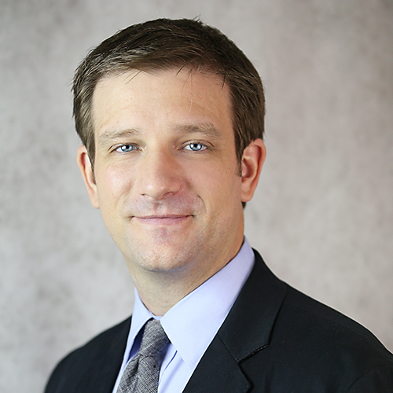

<h1 style="text-align:center;">Ragin' Cajuns RoboBoat</h1>

*****
Welcome to the [University of Louisiana at Lafayette](https://louisiana.edu)'s entry into the 
[2020 RoboBoat competition](https://roboboat.org). This is Ragin' Cajuns' second design submission to RoboBoat.

Our team is coached by [Dr. Joshua Vaughan](https://userweb.ucs.louisiana.edu/~jev9637/people.html), an Associate Professor at the University of Louisiana at Lafayette. This year's Ragin' Cajun RoboBoat Team members are all [Mechanical Engineering](https://mche.louisiana.edu/) students from Dr. Vaughan's research group, [C.R.A.W.LAB](https://userweb.ucs.louisiana.edu/~jev9637/index.html).

The 2019 Ragin' Cajuns RoboBoat team, who fabricated the hull and laid the groundwork for us to build on, were all graduating seniors in Mechanical Engineering. While all of the students are in the same discipline, the 2020 Ragin' Cajuns have students at many different points in the program. This has allowed for many great mentoring opportunities within the team.

*****

<h2 style="text-align:center;">Ragin' Cajuns RoboBoat Team</h2>
<h3 style="text-align:center;">Coach</h3>

     
    <b style="text-align:center;">Dr. Joshua Vaughan</b> 
    <i style="text-align:center;">joshua.vaughan@louisiana.edu</i> 

<h3 style="text-align:center;">Team Members</h3>

### Gerald
* Picture Received: Yes
* Email Received: Yes
* Phone Received: Yes

### Ben
* Picture Received: Yes
* Email Received: Yes
* Phone Received: Yes

### Dallas
* Picture Received: No
* Email Received: Yes
* Phone Received: Yes

### Bradley
* Picture Received: No
* Email Received: No
* Phone Received: No

### Thomas
* Picture Received: No
* Email Received: No
* Phone Received: No

### Andrew
* Picture Received: No
* Email Received: No
* Phone Received: No

### Nathan
* Picture Received: No
* Email Received: No
* Phone Received: No

### Joseph
* Picture Received: No
* Email Received: No
* Phone Received: No

## Media
### Pictures
### Video
### Other
#### Above taken during development of ASV
## List of Sponsors with logos
## Archive of Previous Vehicles, Design Reports

## Contact Us
* Email: benarmentor@<gmail class="com"></gmail>
* Phone: 1-(337)-967-6860