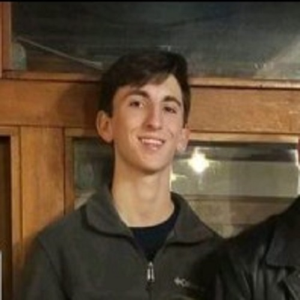
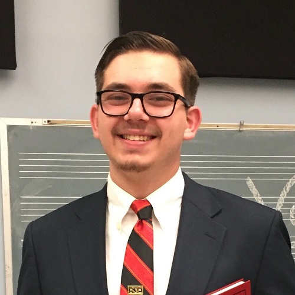

<h1 style="text-align:center;">Ragin' Cajuns RoboBoat</h1>

*****
Welcome to the [University of Louisiana at Lafayette](https://louisiana.edu)'s entry into the 
[2020 RoboBoat competition](https://roboboat.org). This is Ragin' Cajuns' second design submission to RoboBoat.

    

    

 

Our team is coached by [Dr. Joshua Vaughan](https://userweb.ucs.louisiana.edu/~jev9637/people.html), an Associate Professor at the University of Louisiana at Lafayette. This year's Ragin' Cajun RoboBoat Team members are all [Mech. Engineering](https://mche.louisiana.edu/) students from Dr. Vaughan's research group, [C.R.A.W.LAB](https://userweb.ucs.louisiana.edu/~jev9637/index.html).

The 2019 Ragin' Cajuns RoboBoat team, who fabricated the hull and laid the groundwork for us to build on, were all graduating seniors in Mechanical Engineering. While all of the students are in the same discipline, the 2020 Ragin' Cajuns have students at many different points in the program. This has allowed for many great mentoring opportunities within the team.

*****

<!-- Coach -->
<h2 style="text-align:center;">Ragin' Cajuns RoboBoat Team</h2>
<h3 style="text-align:center;">Coach</h3>

	 
	<b style="text-align:center;">Dr. Joshua Vaughan</b> 
	<i style="text-align:center;">joshua.vaughan@louisiana.edu</i> 

*****

<!-- Captains -->
<h3 style="text-align:center;">2020 Team Members</h3>

	<strong style="text-align:center;">Captain</strong> 
	 
	<b style="text-align:center;">Benjamin Armentor</b>

	<strong style="text-align:center;">Vice Captain</strong> 
	 
	<b style="text-align:center;">Joseph Stevens</b>

<!-- Additional Members -->
<!-- Row 1 -->
 

	 
	<b style="text-align:center;">Gerald Eaglin</b>

	 
	<b style="text-align:center;">Nathan Madsen</b>

	 
	<b style="text-align:center;">Dallas Mitchell</b>

<!-- Row 2 -->
 

	 
	<b style="text-align:center;">Thomas Poché</b>

	 
	<b style="text-align:center;">Andrew Durand</b>

	 
	<b style="text-align:center;">Bradley Este</b>

<!-- Row 3 -->
 

	 
	<b style="text-align:center;">Kyle Leleux</b>

<h2 style="text-align:center;">Design Changes</h2>
The main focus of this year's entry was a code cleanup and new control strategy. Unfortunately, the 2020 RoboBoat in-person competition has been cancelled, so this design will not get to physically compete. This, along with sanctions placed by our state and local governments and university, has stifled some of the manufacturing improvements to the design, but the details are flushed out in the documentation.

The 2020 Ragin' Cajuns RoboBoat still uses [ROS](http://wiki.ros.org/) as the computer network's communication platform. We have improved the computer vision system by adding an additional [ZED Stereo Camera](https://www.stereolabs.com/zed/). We have adjusted our SLAM from [gmapping](http://wiki.ros.org/gmapping) to [RTab-Map](http://wiki.ros.org/rtabmap). Lastly, the control code has been overhauled to use Model Predictive Control using the [ACADO Toolkit](https://acado.github.io/). This control method enables mathematically optimal control by minimizing a cost function that we define.

On the hardware side, we wanted to expand our enclosure to allow for more computing power and add a cooling system. The enclosure has been redesigned to raise it off of the hull's bridge to allow for an array of fins to absorb the heat through conduction from the enclosure and expel it through natural convection while at rest, but forced convection when the vessel has surge motion. The manufacturing was not completed, but the design is complete. A huge thanks go out to Hammond Manufacturing and AWC for their generous donations.

<h2 style="text-align:center;">Development</h2>

<!-- Row 1 -->

	

	

<!-- Row 2 -->

 

	

	

<!-- Row 3 -->
 

	

	

<!-- Row 4 -->
 

	

	

<!-- Row 5 -->

 

	

	

 

<h2 style="text-align:center;">Documentation</h2>
* Technical Design Report (to be linked soon)
* Team Video (to be linked soon)

*****

<h1 style="text-align:center;">2019 Ragin' Cajuns</h1>

	<strong style="text-align:center;">Captain</strong> 
	 
	<b style="text-align:center;">Christian Gary</b> 
	<!-- <i style="text-align:center;">TBD@something.com</i>  -->

<!-- Row 1 -->
 

	 
	<b style="text-align:center;">Luke Matt</b> 
	<!-- <i style="text-align:center;">TBD@something.com</i>  -->

	 
	<b style="text-align:center;">Kaleb Gautreaux</b> 
	<!-- <i style="text-align:center;">TBD@something.com</i>  -->

	 
	<b style="text-align:center;">Grant Bellard</b> 
	<!-- <i style="text-align:center;">TBD@something.com</i>  -->

***** 

<h2 style="text-align:center;">Highlights</h2>
<!-- Row 1 -->

	

	

	

<!-- Row 2 -->
 

	

	

	

<!-- Row 3 -->
 

	

	

	

<h2 style="text-align:center;">Documentation</h2>
* [Technical Design Report](ULL_RB19_TDR.pdf)
* [Team Video](https://www.youtube.com/watch?v=DXaP6OPKAoY&feature=youtu.be)

*****

<h2 style="text-align:center;">Our Sponsors</h2>

This project would not be possible without the donations from our sponsors.

 

Thank you all for your generosity and support.

<!-- Row 1 -->
 

	 

<!-- [Website](https://www.hammfg.com) -->

	 

<!-- [Website](https://www.awc-inc.com/) -->

<h2 style="text-align:left;">Contact Us</h2>
* Email: benarmentor@gmail.com
* Phone: 1-(337)-967-6860